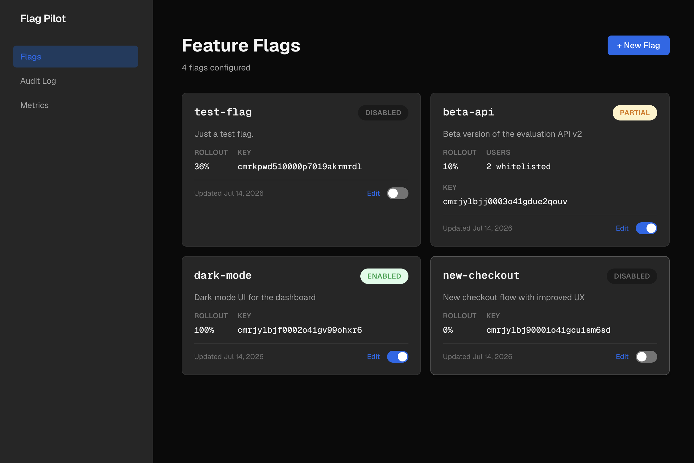

<p align="center">
  
</p>

<h1 align="center">Flag Pilot</h1>

<p align="center">
  <b>Feature flag management system with dashboard, REST API, and client SDK.</b>
</p>

<p align="center">
  <a href="https://flag-pilot-dashboard.vercel.app">Demo</a> · 
  <a href="https://github.com/juancaricodev/flag-pilot">Repository</a> · 
  <a href="docs/deployment.md">Deployment Guide</a>
</p>

<hr>

<p align="center">
  <a href="https://github.com/juancaricodev/flag-pilot/blob/main/LICENSE">
    
  </a>
  <a href="https://github.com/juancaricodev/flag-pilot/stargazers">
    
  </a>
  <a href="https://github.com/juancaricodev/flag-pilot/network/members">
    
  </a>
  <a href="https://github.com/juancaricodev/flag-pilot/issues">
    
  </a>
</p>

<hr>

## Overview

**Flag Pilot** is an open-source feature flag management system built with modern web technologies. It provides a dashboard UI, REST API, and client SDK for managing feature flags across environments.

### Key Features

- **Real-time flag evaluation** — Toggle features instantly across environments
- **Multi-environment support** — Manage flags per environment (dev, staging, production)
- **Audit trail** — Track who changed what and when
- **REST API** — Integrate with any application via HTTP
- **Dashboard UI** — Visual interface for managing flags
- **Docker deployment** — Ready for production with Docker Compose

### Tech Stack

| Component      | Technology                                    |
| -------------- | --------------------------------------------- |
| Dashboard      | Next.js 16, React 19, TypeScript, CSS Modules |
| API            | NestJS 11, Prisma 6, PostgreSQL               |
| Infrastructure | AWS EC2, Docker Compose, GitHub Actions       |
| Testing        | Jest, React Testing Library                   |

## Architecture

Flag Pilot follows **Hexagonal Architecture** (Clean Architecture) with **Screaming Architecture** principles:

```
flag-pilot/
├── apps/
│   ├── dashboard/           # Next.js frontend
│   │   ├── src/
│   │   │   ├── app/         # App Router pages
│   │   │   ├── components/  # Atomic Design (atoms → molecules → organisms)
│   │   │   ├── actions/     # Server Actions
│   │   │   └── data/        # Data fetchers
│   │   └── ...
│   └── api/                 # NestJS backend
│       ├── src/
│       │   ├── domains/     # Domain logic (pure, no dependencies)
│       │   ├── infrastructure/  # External concerns (DB, HTTP, Auth)
│       │   └── shared/      # Shared types
│       └── ...
├── packages/
│   └── shared/              # Shared TypeScript types
├── openspec/                # Specifications and design docs
└── docs/                    # Project documentation
```

### Design Principles

- **Hexagonal Architecture** — Domain logic isolated from infrastructure
- **Atomic Design** — Component hierarchy: atoms → molecules → organisms
- **SDD (Spec-Driven Development)** — Specifications before code
- **TDD** — Test-Driven Development with strict RED → GREEN → REFACTOR

## Quick Start

### Prerequisites

- Node.js 20+
- pnpm
- PostgreSQL

### Installation

```bash
# Clone the repository
git clone https://github.com/juancaricodev/flag-pilot.git
cd flag-pilot

# Install dependencies
pnpm install
```

### Development

```bash
# Run all apps in development mode
pnpm dev

# Run dashboard only
pnpm --filter dashboard dev

# Run API only
pnpm --filter api start:dev
```

### Testing

```bash
# Run all tests
pnpm test

# Run dashboard tests
pnpm --filter dashboard test

# Run API tests
pnpm --filter api test
```

## Deployment

### Dashboard (Vercel)

Automatically deployed on push to `main`.

- **Production**: [flag-pilot-dashboard.vercel.app](https://flag-pilot-dashboard.vercel.app)

### API (AWS EC2)

Deployed via GitHub Actions with Docker Compose.

```bash
# Production deployment
docker-compose --env-file .env.prod -f docker-compose.prod.yml up -d
```

## API Endpoints

| Method | Endpoint         | Description       |
| ------ | ---------------- | ----------------- |
| GET    | `/health`        | Health check      |
| POST   | `/auth/login`    | User login        |
| POST   | `/auth/register` | User registration |
| GET    | `/flags`         | List all flags    |
| POST   | `/flags`         | Create a flag     |
| PATCH  | `/flags/:id`     | Update a flag     |
| DELETE | `/flags/:id`     | Delete a flag     |

## Contributing

Contributions are welcome! Please read our [Contributing Guide](CONTRIBUTING.md) before submitting a pull request.

## License

This project is licensed under the MIT License - see the [LICENSE](LICENSE) file for details.

---

<p align="center">
  Built with ❤️ using Next.js, NestJS, and PostgreSQL
</p>
